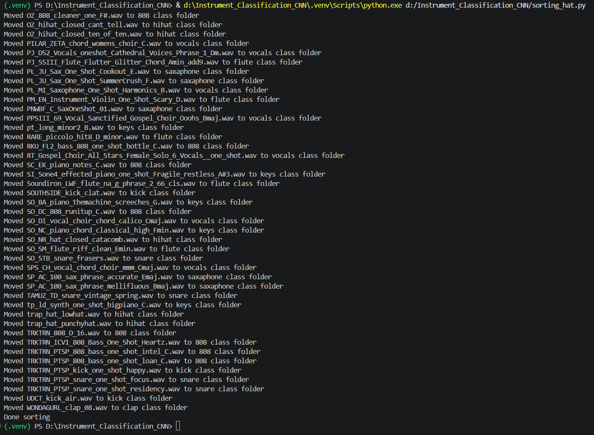

# Instrument_Classification_CNN

## Introduction
This personal project uses TensorFlow to build, train and evaluate a classification model which is able to distinguish between audio clips of ten different instruments. Sound classification via Machine Learning is an extremely powerful tool with many real-world use cases such as voice recognition and speech-to-text translation. 

The specific scope of this project revolves around classifying sounds that would be used in a DAW (digital audio workstation) and as a producer myself would find useful in particular for organizing large directions of various sounds.

## Background
## FFT and STFT
Audio signals contain a large spectrum of freqeuncies which together form a collective sound. The **Fourier Transform** allows for the decomposion of a signal into its constituent frequencies, creating a spectrum. In particular for signal processing, the **Fast Fourier Transform (FFT)** is commonly used as a fast and effective way to compute the Fourier transform. However this spectrum is still not enough for an ML model to effectively distinguish between different types of sounds as we need to consider how these frequencies vary over time. 

The solution to this is the **Short-Time Fourier Transform (STFT)**, which takes the FFT at stepped fixed-sized windows of the signal over time and then stacks them on top of one another to create a visual representation of the sound over time including variations of amplitude of different frequencies. 

*Figure 1: Short-time Fourier Transform*

Source: Jeon, H., Jung, Y., Lee, S., & Jung, Y. (2020), 
“Area-Efficient Short-Time Fourier Transform Processor for Time–Frequency Analysis of Non-Stationary Signals,” Applied Sciences.
Retrieved from ResearchGate.*

### Mel Spectrogram
The Mel scale uses the human perception of sounds by giving higher resolution at lower frequency allowing equal pitch distances to sound equally spaced. This is because humans are able to differenciate sounds at lower frequencies more easily that those at higher frequencies. The Mel-spectrogram uses mel scale frequencies by constructing a **Mel filter bank** which is applied to the spectrogram obtained by STFT. This filter bank is composed of a collection of mel bands which are collections of frequencies associated with the different frequencies we actually hear. 
Mel Spectrograms work better than regular spectrograms for audio classification as it reduces the size of the model input (by grouping by frequency bands) as well as aligns closer to what we actually hear in terms of sound.

## Data Collection and Preprocessing
### Data Sources
All of the data collected in this project comes from my own producer library, in particular from sound packs (such as Cymatics) and Splice (a sample library platform). The following are the dataset sizes for each class:
| Instrument Class | ID | Total count (train/val) |
|---|---:|---:|
| Hihat | 0 | 136 |
| Snare | 1 | 132 |
| 808 | 2 | 157 |
| Clap | 3 | 106 |
| Kick | 4 | 132 |
| Violin | 5 | 56 |
| Flute | 6 | 58 |
| Saxaphone | 7 | 65 |
| Vocals | 8 | 56 |
| Keys | 9 | 66 |

*Figure 2: Instrument Classes and Number of Samples Per Class*

### Data Cleaning
Most of the samples from the unprocessed dataset are of varying lengths, however the classifier always expects the same size input dimensions. To preprocess the dataset, each sample was first downsampled to 16.00 kHz and converted to monochannel to make the inputs uniform and reduce computation size. Due to the Nyquist limit, the resulting maximum reconstructed frequency is thus 8.00 kHz which is enough to reconstruct all instruments in the dataset. Then a rolling window filter is applied to the sounds to cut out deadspace below a threshold. Finally, each sample is cut into a set size of 0.25s centered around the peak volume within that sample and padding with zeros if the duration is less than 0.25s. 

All these preprocessing steps can be found in [clean.py](Preprocessing/clean.py).

### Data Loader
When the requested by the model, the dataloader will select a batch of samples post-processing and return a batch of corresponding mel spectrograms using 64 mel bands. The data loader can be found in [audio_dataset.py](audio_dataset.py).

The following figure shows mel spectrograms for each of the ten different instrument classes. Sound clips from the same instrument class will generate similar mel spectrograms, all which can be viewed in the [mel spectrograms folder](mel_spectrograms) in this repo.

*Figure 3: Example Mel Spectrograms of the Ten Instrument Classes*

## Model
The classifier used for this project was built using the Tensorflow Keras API. For feature extraction, there are 3 Conv2D layers using 3x3 kernels and ReLU activation as well as 2 in-between MaxPooling2D layers to reduce dimensionality (originally there was 3, however each sound is only 0.25s which makes the resulting mel spectrogram small). For learning, there is a single fully connected dense layer, followed by a dropout layer and finally the output layer which has output size 10 for the instrument classes.

The model can be found in [classifier_model.py](classifier_model.py).

## Training and Evaluation
The dataset was split into training and validation sets (80:20 split) and the model was trained using **categorical cross-entropy loss** and using the Adam optimizer with a fixed learning rate. The validation metric for choosing the best model was simply the validation accuracy: how accurately the model the correct instrument from the validation set. Since both training and validation sets were small in size, training was done effectively on the CPU which took only around 5 minutes (on a Ryzen 9 7900x). The training history can be viewed [here](model_history.csv), noting the early stopping callback used to reduce overfitting hence why the training ended after 15/30 epochs.

The best model was then evaluated on the test set (with 8-12 test sounds per class), yielding the following normalized confusion matrix:

*Figure 4: Confusion Matrix over the Test Set*

The model achieved a **test accuracy of 91.35%**. As shown in the figure above, the model was able to correctly classify all the drum-based as well as vocal (choir) sounds. The model was also highly accurate when classifying audio clips of flute, and keys. The worst performing class for the model was clips of violin with only a 50% accuracy with the most common incorrect prediction of saxaphone occuring 25% of the time. 

## Real-World Application: Sorting by Instrument Class
Using the trained model, I am able to [place instruments into sorted directories](sorting_hat.py) from an unsorted collection of sounds. This is rather useful for sound organization and much faster than manually sifting through each sound, even if the sorted results are not 100% perfect.

*Figure 5: Model Sorting by Instrument Class*

## Conclusion
Sound classification via STFT and mel spectrogram is a useful and interesting application of ML in the world of audio processing. Tensorflow and Keras libraries are effective for building a model that is able to classify various different instruments given a fairly small dataset and is able to achieve a high accuracy on new test data. This project mainly demonstrated the application of sorting audio clips by instrument class, however other prevalent real-world applications of audio classification models include automated customer support, home smart-applications, and security systems. 

## Sources
https://course.ece.cmu.edu/~ece491/lectures/L25/STFT_Notes_ADSP.pdf

https://medium.com/analytics-vidhya/understanding-the-mel-spectrogram-fca2afa2ce53

Jeon, H., Jung, Y., Lee, S., & Jung, Y. (2020). Area-Efficient Short-Time Fourier Transform Processor for Time–Frequency Analysis of Non-Stationary Signals. Applied Sciences. Figure: Short-time Fourier transform (STFT) overview. Retrieved from ResearchGate.
